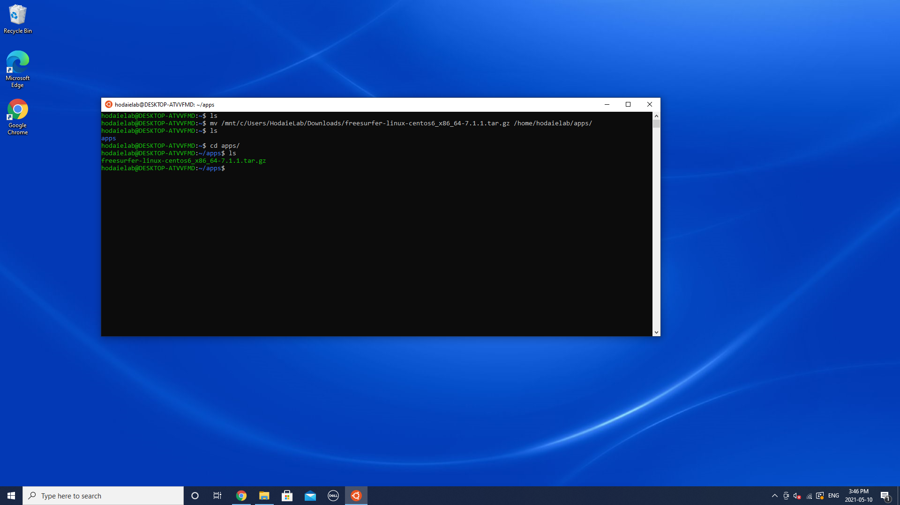
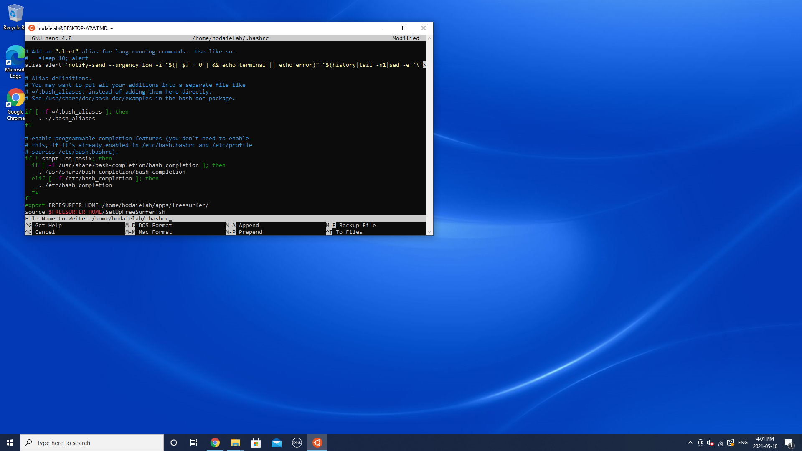

# FreeSurfer 
FreeSurfer is a software framework for the analysis of structural and functional MR imaging data. It is developed by the [Laboratory for Computational Neuroimaging (Harvard University)](https://martinos.org/). FreeSurfer offers a variety of MRI processing and analysis tasks, such as reconstruction of cortical surface models, anatomical segmentation of the T1 data using cortical gray matter atlases, thalamic, hippocampal segmentation and statistical analysis of the morphometry. Our lab primarily uses FreeSurfer for the T1 weighted MRI data processing and analysis.

## How to install freesurfer?
FreeSurfer requires Unix-based environment, therefore it can work on Linux or MacOS working stations. If you use Windows 10 as your main OS, you need to set up the [Linux subsystem on Windows](https://hungs.github.io/hodaie/computing/setup.html) first.

### Download
To install FreeSurfer on your computer, please download [this archieve](https://surfer.nmr.mgh.harvard.edu/pub/dist/freesurfer/7.1.1/freesurfer-linux-centos6_x86_64-7.1.1.tar.gz), or check the official [FreeSurfer website](https://freesurfer.net). 

### License
FreeSurfer is free software, however the [license (click here)](https://surfer.nmr.mgh.harvard.edu/registration.html) should be obtained in order to make the framework fully operational.

### Setup


The following tutorial is for Windows 10 computers with Linux subsystem installed. 

<details open markdown="block">
  <summary>
    Click to read the setup instructions
  </summary>
  Once you launch Ubuntu app, make the applications directory for your Unix imaging apps.

  

  Once you  downloaded the archive, move it to the apps directory by typing following command:
  

  Now you will be able to see the archieve in your apps directory.
  

  Unzip the archieve using following command:
  

  After extraction is over, check the set up by typing these commands:
  

  If you see similar output, your set up is almost completed!
  Before processing, be sure to copy your license.txt file to the $FREESURFER_HOME directory. 

  In addition, you can add the source command to your ~/.bashrc file, so freesurfer will be loaded automatically everytime you open the Terminal. To do that, type 

  ```scss
  sudo nano ~/.bashrc
  ```


  ,press enter, then type your password. You will see the _.bashrc_ source code in the editing mode. Scroll the file down and add following:
  

  Save changes and restart Ubuntu app.
</details>


## Freesurfer analysis


Detailed tutorials can be found [here](https://surfer.nmr.mgh.harvard.edu/fswiki/Tutorials).
For the longitudinal complete MR segmentation we are using contrast-free T1 Weighted 3D MR imaging. 

Main reconstruction command - _recon-all_ takes T1 MR data (in nifti format) and performs all steps, or part of FreeSurfer grey matter reconstruction and segmentation procress.

An example of base terminal command: 

```scss
 recon-all -all -subject subjectname -i /path/to/input_volume 
 ```
where _-all_ flag, performing all steps of reconstruction; _-subject_ name of subject directory created in $SUBJECTS_DIR folder; _-i_ path to input MRI volume.

The entire reconstruction process typically takes 8-24 hours per one subject.

# NEED MORE DETAILS HERE!!!!!11!!


# F.A.Q
Here is the summary of the most frequent errors you may have and how to solve it.
<details open markdown="block">
  <summary>
    Open F.A.Q.
  </summary>
  
  ### Question 
  
  _recon-all_ does command does not work - 'bad interpreter' error.
  
  ### Answer 
  This may happen because FreeSurfer uses differend version of shell (tcsh). You need to type
  ```scss
  sudo apt-get install tcsh 
  ```


  If you see "Unable to locate package" error, type 

  ```scss
  sudo apt-get update 
  ```
   

  and then try to install the package again.
 ### Question 
  _recon-all_ stuck at _mris_topology_fix_/defect correction.
  ### Answer 
  Sorry (expand here😁)
</details>

