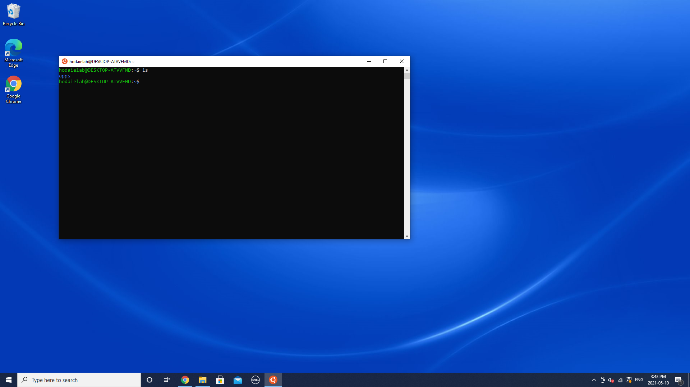
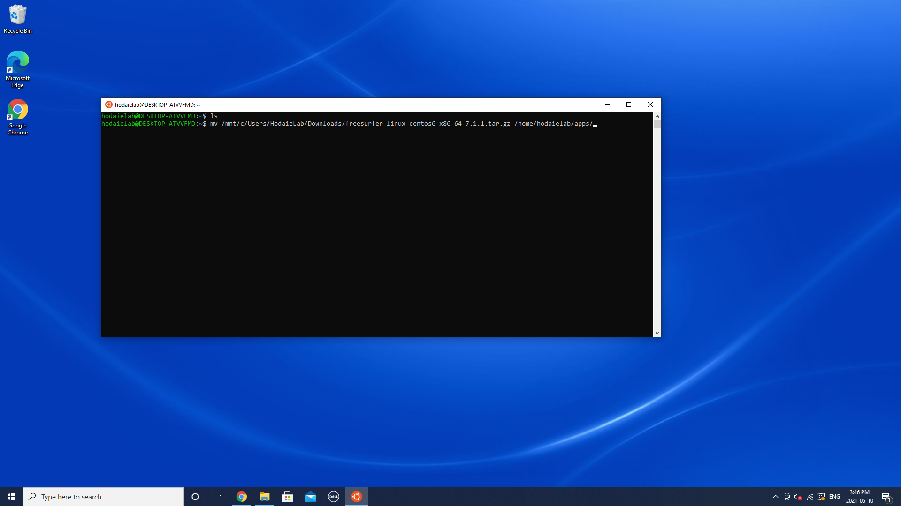
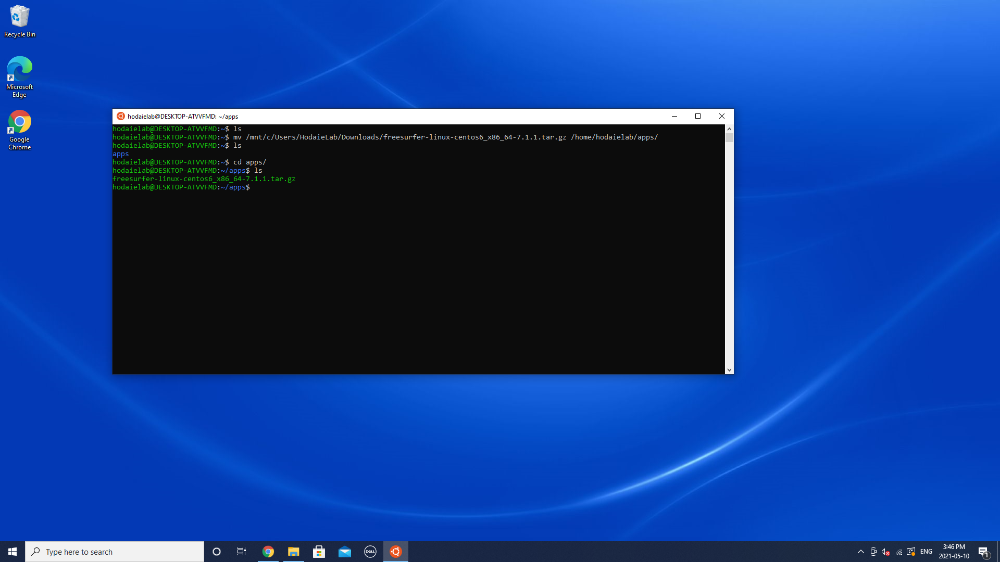
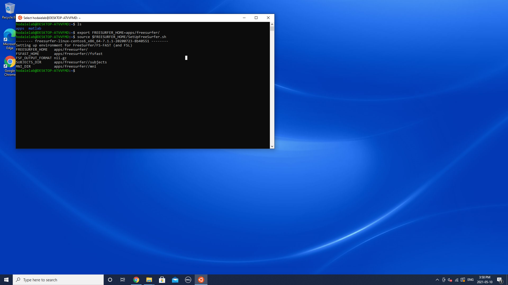
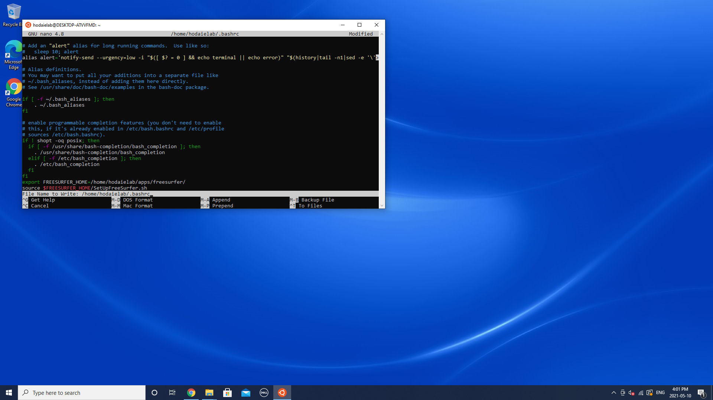

# FreeSurfer setup instructions

The following tutorial is for Windows 10 computers with Linux subsystem installed. [Click here](https://hungs.github.io/hodaie/computing/setup.html) to learn how to enable WLS.

---

1) Launch Ubuntu app and make the applications directory for your Unix imaging apps.



2) Once you  downloaded the archive, move it to the apps directory by typing following command:



3) Now you will be able to see the archieve in your apps directory.



4) Unzip the archieve using following command:


5) After extraction is over, check the set up by typing these commands:



If you see similar output, your set up is almost completed!


Before you start processing your data, be sure to copy your _license.txt_ file to the $FREESURFER_HOME directory.

In addition, you can add the source command to your ~/.bashrc file, so freesurfer will be loaded automatically everytime you open the Terminal. To do that, type


```scss
  sudo nano ~/.bashrc
```


Press enter, then type your password. You will see the _.bashrc_ source code in the editing mode. Scroll the file down and add following:


Save changes and restart Ubuntu app.
