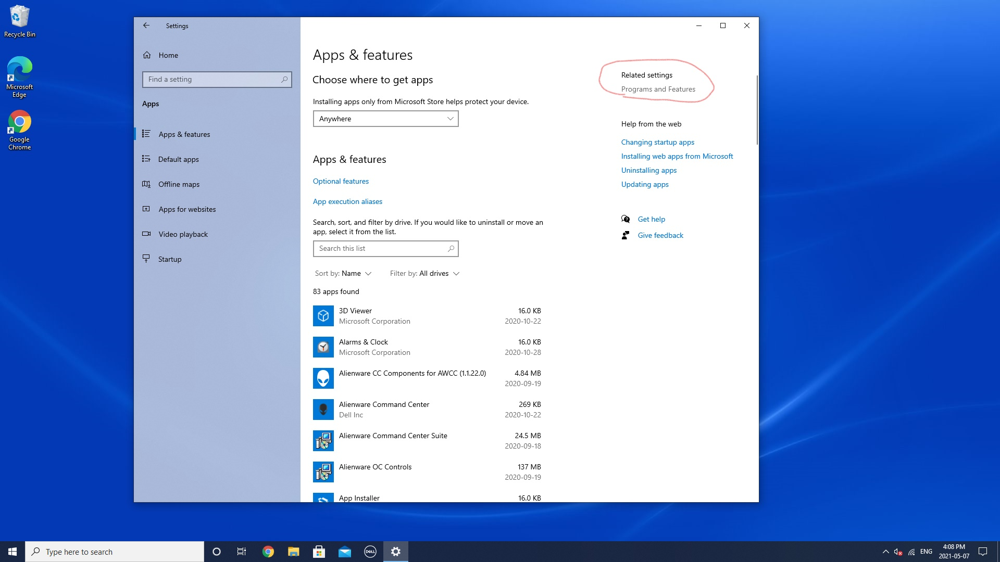
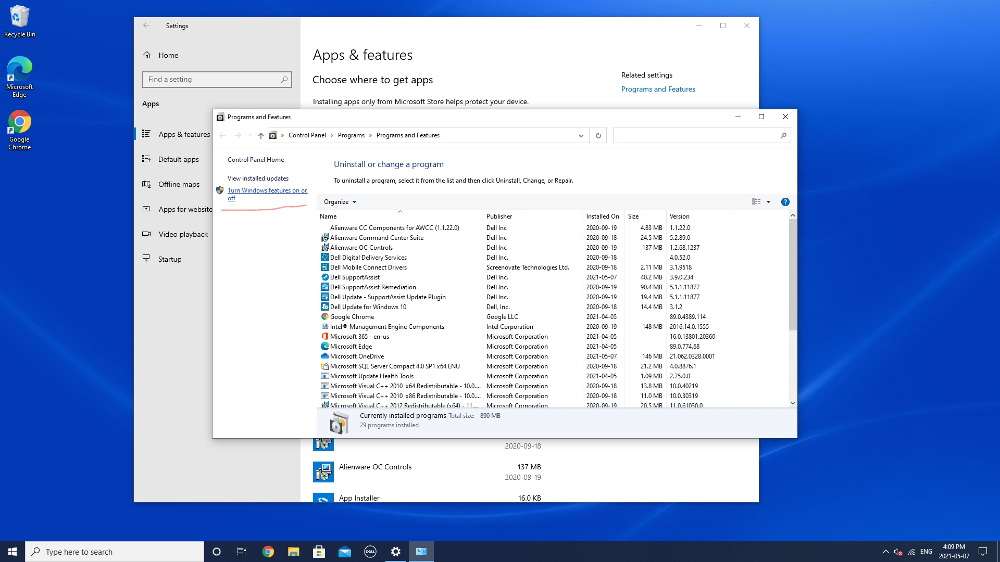
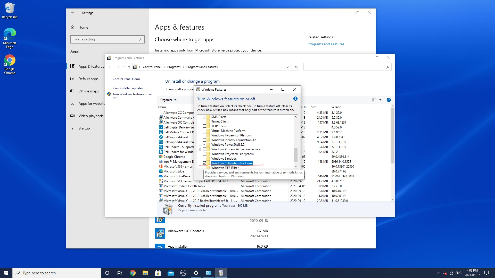
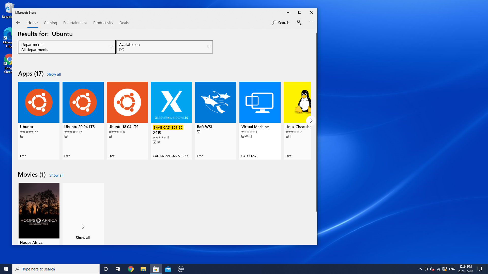
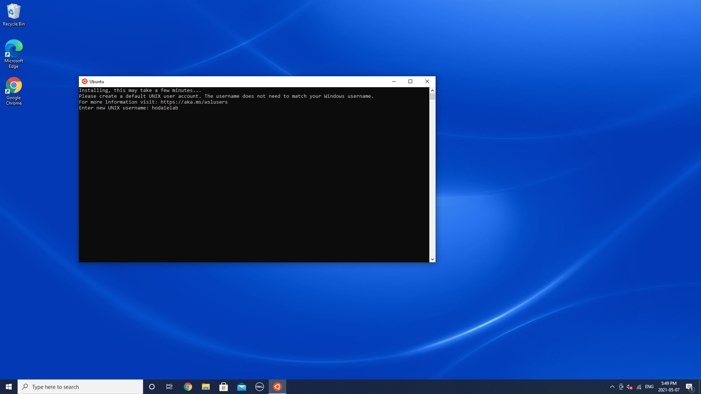

<!-- ## Setup a new workstation -->

# Setup Windows Linux subsystem
On Windows 10, the Windows Subsystem for Linux (WSL) is a feature that creates a lightweight environment that allows you to install and run supported versions of Linux (such as Ubuntu, OpenSuse, Debian, etc.) without the complexity of setting up a virtual machine or different computer.
If you want to run distros of Linux on Windows 10, you must first enable the Windows Subsystem for Linux feature before you can download and install the flavor of Linux that you want to use.

### Enabling Windows Subsystem for Linux using Settings

1. To install WSL using Setting on Windows 10, use these steps:
Open Settings, Click on Apps and Under the "Related settings" section, click the Programs and Features option.

2.  Click the Turn Windows features on or off option from the left pane.

3.  Check the Windows Subsystem for Linux option. Click OK and restart PC

Once you complete the steps, the environment will be configured to download and run the distros of Linux on Windows 10.

### Installing Linux distros using Microsoft Store
1.  To install a distribution of Linux on Windows 10, open MS Store and search for the Linux distribution (Ubuntu recommended)

2.  After installation is done, click Launch button. Create a username for the Linux distro and press Enter. 

3.  Specify a password for the distro and press Enter.

Done! You are all set!