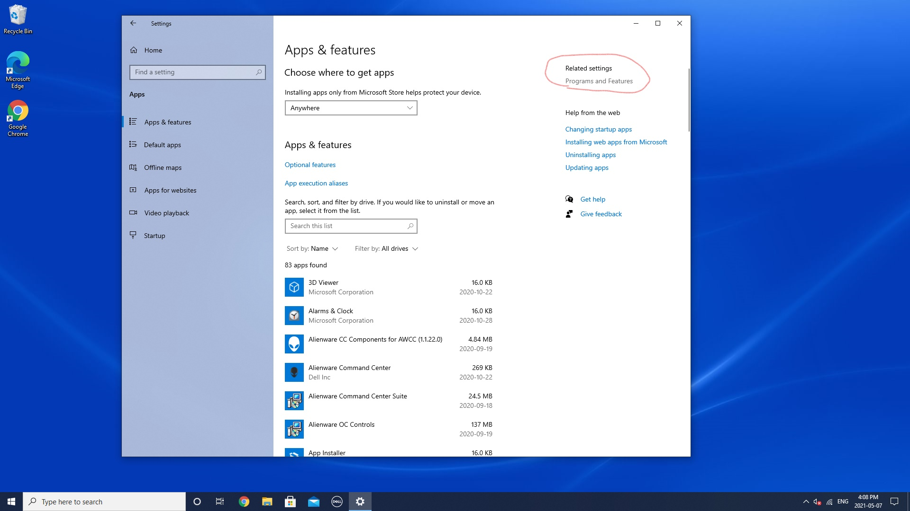

<!-- ## Setup a new workstation -->

### Setup Windows Linux subsystem
On Windows 10, the Windows Subsystem for Linux (WSL) is a feature that creates a lightweight environment that allows you to install and run supported versions of Linux (such as Ubuntu, OpenSuse, Debian, etc.) without the complexity of setting up a virtual machine or different computer.
If you want to run distros of Linux on Windows 10, you must first enable the Windows Subsystem for Linux feature before you can download and install the flavor of Linux that you want to use.

1.  Enabling Windows Subsystem for Linux using Settings
To install WSL using Setting on Windows 10, use these steps:
Open Settings, Click on Apps and Under the "Related settings" section, click the Programs and Features option.

